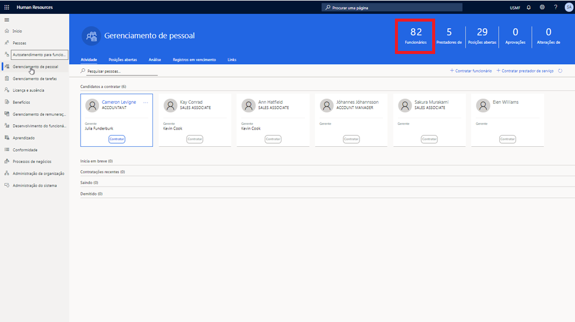

---
demo:
    title: 'Demonstração 1: Atribuindo cursos de aprendizado'
    module: 'Módulo 4: Conheça os princípios básicos do Microsoft Dynamics 365 Human Resources'
---

## Demonstração 1 - Atribuindo cursos de aprendizado

1. Acesse a home page do **Microsoft Dynamics 365 Human Resources**.  
    No Microsoft Dynamics 365 Human Resources, os gerentes de pessoal podem atribuir cursos de treinamento aos funcionários. Neste exemplo, é preciso atribuir o treinamento disponível para funcionários em seus primeiros 30 dias à nova contratada da empresa, Alicia.

1. No seletor de empresas na parte superior direita, verifique se a empresa a que você está se conectando é **USMF**. Caso não seja, altere para **USMF**.

1. No canto superior esquerdo da tela, selecione a guia **Gerenciamento de pessoal**.

1. No lado direito da página **Gerenciamento de pessoal**, clique no número logo acima da palavra **Funcionários**.

    

1. Na tabela **Funcionários**, selecione o nome do funcionário ao qual atribuir o treinamento. Por exemplo, **Alicia Thornber**.  
    Em seguida, use a guia Competências e desenvolvimento para ver os links para informações sobre certificados, formação e habilidades de um funcionário.

1. Na página do funcionário, selecione a guia **Competências e desenvolvimento**.

1. Na seção **Competências**, selecione **Cursos**.  
    Na página de cursos de um funcionário, você pode verificar se algum curso foi atribuído. No caso de Alicia, não há nenhum curso na lista. Para ver todos os cursos disponíveis para atribuição, selecione o menu ID do curso.

1. Selecione o menu **ID do curso**.

1. Na tabela Cursos, selecione o menu **ID do curso**.

1. No menu **ID do curso**, selecione o menu **Status do curso**.

1. No menu **Status do curso**, marque a caixa **O status do curso é exatamente**.  
    Em seguida, talvez você precise editar o filtro **ID do curso** que está aplicado, por exemplo, alterando-o para exibir apenas os cursos abertos.

1. Na caixa **O status do curso é exatamente**, Digite **Aberto**.

1. No menu **Status do curso**, selecione **Aplicar** para ver todos os cursos abertos disponíveis.  
    Agora, você pode atribuir o curso de treinamento de nova contratada à Alicia.

1. Selecione o curso que você deseja atribuir. Por exemplo, **00006 Treinamento de novo contratado**.

1. No painel Transferir dados do curso, selecione **Sim**.

1. Na página **Cursos**, na coluna **Data de início**, selecione o **ícone de calendário**.

1. No calendário, selecione a data de início. Por exemplo, **5 de janeiro de 2021**.

1. Na coluna **Data de término**, selecione o **ícone de calendário**.

1. No calendário, selecione a data de término do treinamento. Por exemplo, **8 de janeiro de 2021**.

1. No lado esquerdo da página **Cursos**, selecione **Salvar** para salvar suas alterações.

1. No lado direito da página **Cursos**, clique no **X** para fechá-la.  
    Se você precisar alterar qualquer curso atribuído, selecione Cursos de novo.

1. Na página de **funcionário**, na seção **Competências**, selecione **Cursos**.

1. Na página **Cursos**, na barra de navegação, selecione **Editar** para fazer alterações.

1. Na coluna **Data de início**, selecione o **ícone de calendário**.

1. Selecione a nova data de início para o curso. Por exemplo, **6 de janeiro de 2021**.

1. Selecione **Salvar**.

1. Clique no ícone de **X** para fechar a página.

1. Na página de **funcionário**, clique no ícone **X** para fechá-la.
