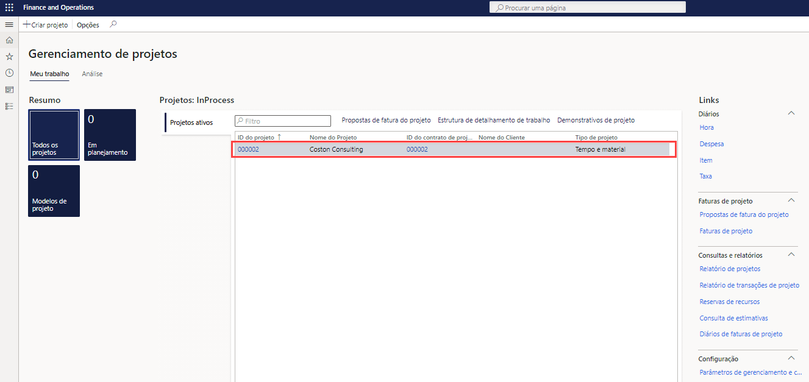
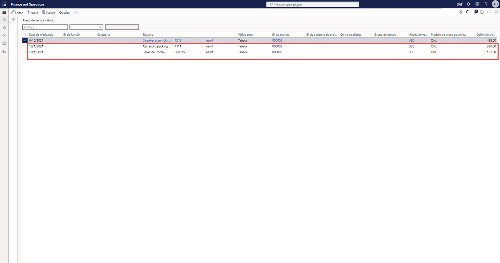
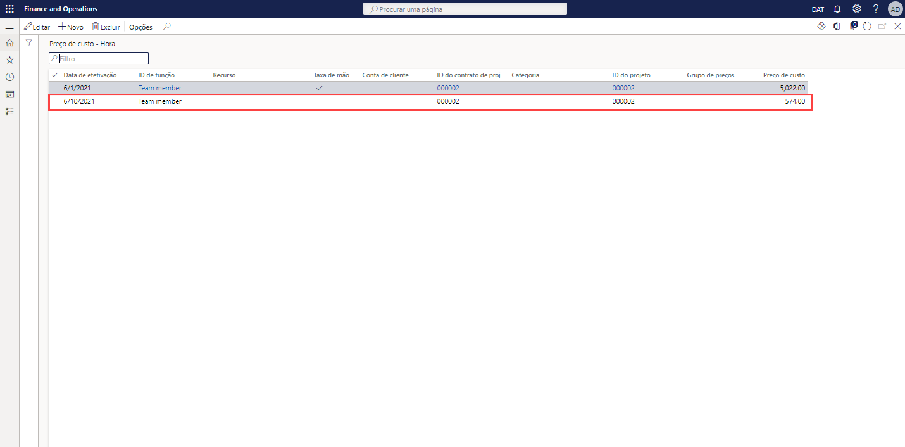

---
demo:
    title: 'Demonstração 1: Precificação do Project Operations'
    module: 'Módulo 5: Conheça os Princípios básicos do Microsoft Dynamics 365 Project Operations'
---

## Demonstração 1 - Precificação do Project Operations

1. Acesse o espaço de trabalho **Gerenciamento de projetos**.  
    Nesta demonstração, vamos configurar os preços de vendas e de custo nas operações de projeto. E vamos ver como os custos e os preços são derivados de uma fatura previamente publicada.

1. No seletor de empresas na parte superior direita, verifique se a entidade legal a que você está conectado é **USSI**.  
    Caso não seja, altere a organização para **USSI**.

1. Na tabela **Projetos ativos**, selecione o projeto **00000093 Contoso Consulting**. A visualização de detalhes do projeto é aberta.

    

1. Na página **Contoso Consulting**, na barra de navegação, selecione a guia **Gerenciar**.

1. No menu **Gerenciar**, selecione **Diários de faturas**.  
    Aqui, identificamos uma fatura em que horas foram aplicadas.

1. Em **Transações da fatura**, na coluna **Preço de venda**, aponte para **350,00**.  
    Nesta visualização, podemos observar que o preço de venda do recurso Aaron Con, um gerente de projeto da USSI, tem uma taxa de encargo de 350 dólares. Vamos analisar a configuração de precificação para saber como essa taxa foi determinada.

      

    Embora possamos examinar os preços do projeto separado, vamos começar com o espaço de trabalho **Gerenciamento de projetos** para visualizar toda a configuração de precificação.

1. Acesse o espaço de trabalho **Gerenciamento de projetos**.

1. No lado direito da tela, na seção **Links**, no submenu **Configuração**, selecione **Preço de venda (hora)**.

1. Na página **Preço de venda – hora**, na coluna **Precificação** da tabela, aponte para **350,00**.  
Nesta visualização, podemos observar onde o preço de venda de Aaron Con de 350 dólares foi configurado.

1. Aponte para toda a primeira linha.  
    Se examinarmos toda a linha, poderemos ver que Aaron está configurado como gerente de projetos e, mais especificamente, que a taxa está associada a uma determinada ID do projeto para a Contoso Consulting.

1. Na coluna **Recurso**, aponte para todas as outras linhas com recursos atribuídos.  
    Nesta tabela, podemos observar que há outros gerentes de projeto configurados, mas eles não estão alocados especificamente a IDs de projeto e, portanto, suas taxas só são específicas para a categoria e os recursos atribuídos.

      

    Essa matriz é flexível o suficiente para dar suporte ao nível de detalhes que vimos com a Contoso Consulting e Aaron Con, bem como a um modelo de precificação mais genérico, como preço de US$ 300 mostrado aqui.

1. Para o Projeto Contoso, navegue para a página **Diários de faturas**.  
    Voltando à fatura publicada, vamos examinar a mesma transação de horas publicadas e analisar os custos associados a Aaron Con selecionando a ID da transação na linha de transação da fatura.

1. Na seção **Transações da fatura**, selecione a guia **Hora**. Na tabela exibida, na coluna **ID da transação**, selecione uma ID da transação.

    

1. Na página **Transações de horas**, selecione a guia **Visão geral**. Na tabela mostrada, na coluna **Preço de custo**, aponte para **200,00**.  
    Na visualização de transações de hora, podemos ver a entrada para Aaron Con e o preço de custo associado de US$ 200,00. Vamos voltar e examinar a configuração de preço de custo para verificar como essa taxa de custo foi derivada.

1. Acesse o espaço de trabalho **Gerenciamento de projetos**.

1. No lado direito da tela, na seção **Links**, no submenu **Configuração**, selecione **Preço de custo (hora)**.

1. Na página **Preço de custo – visualização padrão de hora**, na tabela, aponte para a linha com **1/1/2014** na coluna **Data de efetivação**, **PM** na coluna **Categoria**, **200,00** na coluna **Preço de custo**, e nenhum valor nas outras colunas.  
    Nesta visualização, é possível ver um preço de custo de US$ 200,00 que foi configurado especificamente para a categoria de PM, mas não há outras linhas para Aaron ou nosso projeto Contoso Consulting. Essa também é uma prática comum, pois muitas organizações de serviço aplicam taxas de custo padrão entre categorias, nesse caso, identificadas aqui como funções de projeto. Com frequência, esse custo é uma taxa mista em que a taxa de pagamento do recurso individual só será armazenada na folha de pagamento ou sistema de RH. Em seguida, a taxa de custo padrão será ajustada periodicamente conforme os custos da folha de pagamento forem analisados para assegurar que estejam precisos e as margens estejam sendo atendidas.

    

1. Acesse o espaço de trabalho **Gerenciamento de projetos**.

1. No lado direito da tela, na seção **Links**, no submenu **Configuração**, aponte para **Preço de custo (hora)** e **Preço de venda (hora)**.  

Nesta demonstração, vamos ver como os preços padrão de venda e custo são configurados no Project Operations. Analisamos seu impacto em relação a uma fatura publicada para saber como a configuração desses preços afeta diretamente a fatura por tempo e material apresentada.
