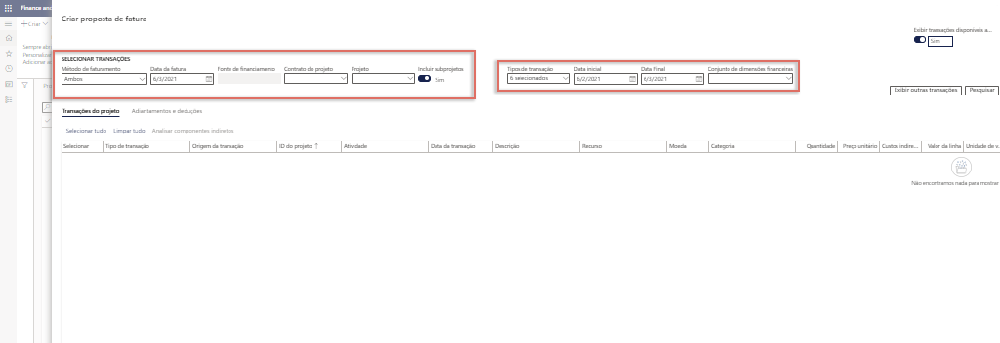
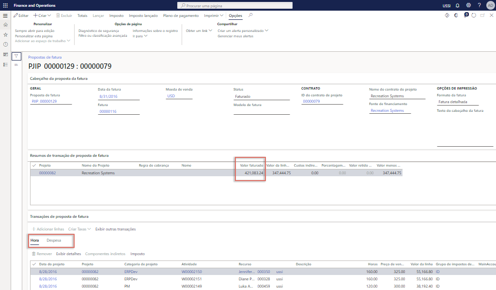

---
demo:
    title: 'Demonstração 2: Criar uma fatura'
    module: 'Módulo 5: Conheça os Princípios básicos do Microsoft Dynamics 365 Project Operations'
---

## Demonstração 2 - Criar uma fatura

1. Acesse o espaço de trabalho **Gerenciamento de projetos**.  
    Nesta demonstração, vamos examinar o processo de faturamento de um único projeto em operações de projeto. Embora seja possível executar faturamento em massa, para fins de demonstração, vamos nos concentrar em apenas um projeto por tempo e material. Também vamos ver os resultados de lançamento e os insights financeiros no demonstrativo de projeto. Vamos começar com o faturamento do projeto. 

1. No seletor de empresas na parte superior direita, verifique se a entidade legal a que você está conectado é **USSI**. Caso não seja, altere a entidade legal para **USSI**.  
    No espaço de trabalho **Gerenciamento de projetos**, podemos ver todos os projetos ativos. Podemos procurar os projetos usando o filtro ou, neste exemplo, vamos selecionar uma ID de projeto conhecida. 

1. Na tabela **Projetos ativos**, na coluna **ID do projeto**, selecione **00000093 Contoso Consulting**.  

1. Em seguida, abra a página **Propostas de fatura do projeto** para visualizar todas as faturas anteriores processadas pela Contoso Consulting. 

1. No painel de ação, na guia **FATURA**, selecione **Propostas de fatura do projeto**. 

1. Na página **Propostas de fatura do projeto**, na barra de navegação, selecione **Nova** e, em seguida, **Proposta de fatura**.  
    Essa é uma fatura por tempo e material simples, portanto, não precisamos selecionar a opção de Proposta de fatura de regra de cobrança. 

    

1. No painel **Criar proposta de fatura**, aponte para as caixas em **Selecionar transações**.  
    Desse ponto, podemos selecionar itens como método de faturamento, data da fatura, fonte de financiamento e projeto. Também podemos optar por incluir subprojetos, como tipos de transações incorporadas, datas de início e término de transações e qualquer dimensão financeira necessária. 

    

1. No menu suspenso **Projeto**, selecione **00000093 Contoso Consulting**. 

1. Para este exemplo, verifique se **Data da fatura** está definida como **01/02/21**, a**Data de início** é **01/02/21** e a data de término é a data de hoje.  
    Depois que as seleções forem feitas, clique no botão Pesquisar para procurar as transações que atendem a esses parâmetros.

1. Selecione **Pesquisar**.  
    Em seguida, para faturar todas as transações, selecione a opção Selecionar tudo. Com isso, os itens que escolhemos para despesas e horas serão selecionados.

1. Na guia **Transações do projeto**, selecione **Selecionar tudo**.

1. Selecione **OK**. 

1. Na página **Proposta de fatura**, aponte para a coluna **Valor da linha de fatura**.  
    Aqui, podemos ver o valor e o resumo da fatura, as transações por hora e as despesas.

    

1. Aponte para a guia **Hora**. 

1. Aponte para a guia **Despesa**.  
    Também é possível alternar e examinar a transação de despesa.  
Em seguida, vamos verificar o botão Totais para saber como ficará a fatura de uma perspectiva de custo e receita.

1. Na barra de navegação, selecione **Totais**.

1. Na página **Totais**, aponte para a coluna **CONTABILIDADE**, a coluna **CLIENTE** e a coluna **Desconto de linha**.  
    Na tela de totais, podemos ver o impacto na contabilidade de qualquer informação de cliente, como limites de crédito, qualquer desconto, imposto, e o impacto global da fatura. 

1. No lado direito da tela, clique no **X** para fechar a página.  
    Agora, estamos prontos pra criar uma visualização impressa para assegurar que todas as informações de faturamento sejam precisas. Algumas organizações usam a visualização durante as reuniões de análise de projeto para assegurar que todos concordem com os totais antes da finalização da fatura. 

1. Na página **Proposta de fatura**, na barra de navegação, selecione **Visualizar impressão**. 

1. Na caixa de diálogo, selecione **Visualizar impressão**.  
    Aqui, é possível ver um exemplo de visualização de impressão para uma fatura Pro forma. 

1. Selecione o **X** para fechar a página.  
    Após a validação de todas as informações e quando estivermos satisfeitos com a visualização de impressão da fatura, poderemos lançar a proposta de fatura.

1. Na barra de navegação, selecione **Lançar**.

1. Selecione a guia **Parâmetros**.

1. Em **PARÂMETRO**, defina **Lançamento** como **Sim**.

1. Em **OPÇÕES DE IMPRESSÃO**, defina **Imprimir fatura** como **Sim**.

1. Selecione **OK**.

1. Na página **Fatura**, aponte para o número da **Fatura**.  
    Agora, um número de fatura foi gerado.  
    Após o lançamento da fatura, poderemos analisar as informações no diário de fatura e fazer uma busca detalhada para as transações de contabilidade.

1. Acesse o espaço de trabalho **Gerenciamento de projetos**.

1. Na tabela **Projetos ativos**, selecione o projeto **00000093** **Contoso consulting**.

1. No painel de ação, na guia **FATURA**, selecione **Diários de fatura**.

1. Na página **Diário de fatura**, na barra de ações, selecione **Comprovante**.

1. Na página **Comprovantes de transações**, aponte para a coluna **Conta contábil**.  
    Os resultados lançados na contabilidade são mostrados aqui. As contas da contabilidade são determinadas pela configuração de conta e as dimensões financeiras são aplicadas a cada projeto.

1. Acesse o espaço de trabalho **Gerenciamento de projetos**. 

1. Na tabela **Projetos ativos**, selecione o **00000093 Projeto Contoso Consulting**.

1. Na página **Contoso Consulting**, na barra de navegação, selecione **Controle**.  
    Desse ponto, podemos ver todos os detalhes do projeto.  
    Em seguida, vamos examinar as finanças do projeto em um demonstrativo.

1. Selecione **Demonstrativos de projeto**.

1. Na página **Demonstrativos de projeto**, aponte para a seção **DATA DO PROJETO**.  
É possível criar um demonstrativo para qualquer intervalo de datas desejado.

1. Marque a caixa **De** e digite **01/02/2021**.

1. Marque a caixa **Até** e digite a data de hoje.

1. Ao concluir, selecione **Calcular**.

    

1. Aponte para **Transações**.  
    Depois que os dados forem atualizados, um gerente de projetos pode optar por fazer uma busca nos detalhes da transação para tomar decisões de projeto ou fazer ajustes necessários. Nesta demonstração, processamos uma fatura por tempo e material com uma transação por hora e outra por despesa. Vimos isso na visualização, depois lançamos a fatura, analisamos o lançamento no razão e, por fim, revisamos o impacto financeiro por meio deste demonstrativo de projeto.
