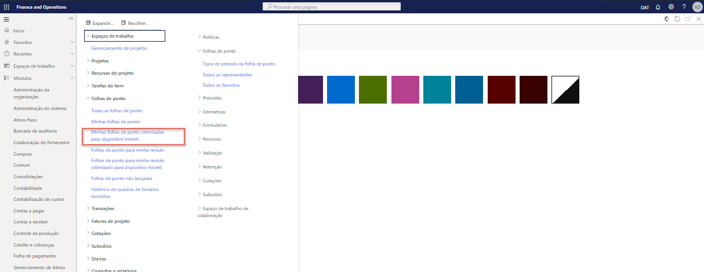
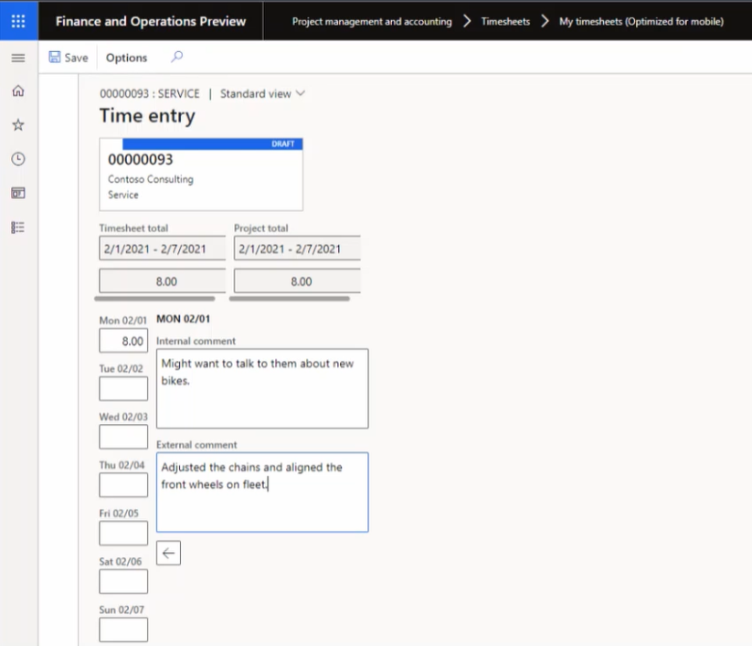

---
demo:
    title: 'Demonstração 3: Explorar os custos do projeto'
    module: 'Módulo 5: Conheça os Princípios básicos do Microsoft Dynamics 365 Project Operations'
---

## Demonstração 3 - Explorar os custos do projeto

Nesta demonstração, veremos com detalhes a criação de uma entrada de tempo e despesa que será cobrada do projeto Contoso Consulting. Vamos explorar as entradas em formatos otimizados para apresentação na web e em dispositivos móveis, e vamos ver como um fluxo de trabalho é usado para gerenciar o processo de aprovação.

1. No **Dynamics 365 para Finance and Operations**, no painel de navegação, selecione **Módulos > Gerenciamento e contabilidade de projeto > Folhas de ponto > Minhas folhas de ponto (otimizadas para dispositivo móvel)**.  
    Para começar, embora eu não esteja em um dispositivo móvel no momento, será possível reconhecer os formulários como apropriados para dispositivos móveis após a seleção da opção **Minhas folhas de ponto (otimizadas para dispositivo móvel)**.

      

    Essa otimização é um diferencial chave para Microsoft Business Applications e ajuda a assegurar que haja uma curva de aprendizado mínima entre o uso na web e em um dispositivo móvel.

1. No seletor de empresas na parte superior direita, verifique se a entidade legal a que você está conectando é **USSI**. Caso não seja, altere a entidade legal para **USSI**.

1. Na página **Minhas folhas de ponto**, selecione **Nova**.  
    Agora, vamos criar uma nova folha de ponto com base nas configurações definidas.

1. No painel **Nova folha de ponto**, aponte para a caixa **Data**.  
    A data especificada determinará o período da folha de ponto.

1. Aponte para **Criar a partir de favoritos**.  
    Se houver favoritos salvos, você poderá selecionar um deles para usar como base e economizar tempo.

1. Ao concluir, selecione **OK**.

1. Na página **Detalhes das minhas folhas de ponto**, selecione o ícone **Nova +**.

1. No painel **Nova folha de ponto**, aponte para a caixa **Entidade legal**.  
    A nova linha da folha de ponto será aberta, com detalhes como cliente, projeto, categoria, propriedades de linha e parâmetros de imposto. Também é possível selecionar outra entidade legal se a entrada de tempo estiver em nome de outra empresa na organização.

1. Selecione o menu **ID do projeto**.

1. Selecione um dos projetos disponíveis, por exemplo, **Contoso Consulting**.

1. Ao concluir, selecione **OK**.  
    A tela otimizada para dispositivos móveis para entrada de projeto será aberta e você poderá começar a reservar suas horas a cada dia para o projeto e a categoria, nesse caso **Serviço**.

1. Na página **Entrada de hora**, na caixa **Seg**, digite **8**.  
    Isso representa entrada de horas de um único dia.

    

1. Na caixa **Comentário interno**, adicione um comentário. Por exemplo: **Talvez queira falar sobre as novas bicicletas**.  
    Também é possível inserir comentários internos e externos em relação ao projeto para assegurar que todas as partes entendam a natureza de horas registradas.

1. Na caixa **Comentário externo**, adicione um comentário. Por exemplo: **As correias foram ajustadas e alinhadas aos rodas frontais na frota**.

1. No painel de navegação, selecione **Salvar**.

1. No menu de navegação à esquerda, em **Folhas de ponto**, selecione **Minhas folhas de ponto**.

1. Na página **Minhas folhas de ponto**, selecione a entrada de hora que você criou.

1. Na guia **Folha de ponto**, aponte para a categoria Coluna.  
    Agora, vamos supor que voltamos a um computador e estamos analisando nosso tempo de dentro do formulário de folha de ponto na web. Ainda podemos ver as mesmas informações, como categoria e horas.

1. Em **Detalhes da linha**, aponte para **Comentário interno** e **Comentário externo**.  
    Também podemos revisar os comentários que inserimos antes. Essas informações estão lá, mas o formato do layout é ligeiramente diferente. Com frequência, esse formato é usado para análise final porque as pessoas podem achar mais fácil revisar e validar seu tempo, especialmente quando alguém é atribuído a vários projetos ou categorias.

1. No painel de navegação, selecione a guia **Fluxo de trabalho**.  
    Quando estivermos satisfeitos com a folha de dados, podermos enviá-la. Cada organização determinará as aprovações necessárias na fase de implementação com base em suas próprias políticas empresariais.

1. No painel **Revisar o fluxo de trabalho da folha de ponto**, selecione **Enviar**.

1. No painel **Revisar o fluxo de trabalho da folha de ponto – Enviar**, inclua os comentários adicionais desejados.

1. Selecione **Enviar**.

1. Acesse a página **Transações de horas**. Se a guia **Transações de horas** estiver esmaecida, acesse a página **Minhas folhas de ponto** e selecione a folha de ponto recém-criada.

1. Examine a página **Transações de horas**.  
    Após a aprovação, os resultados serão lançados e ficarão visíveis na página Transações de horas. Podemos ver todas as informações relevantes, como entidade legal, projeto, categoria, horas e, nesse caso, até uma visualização dos preços de custo e venda.  

Em seguida, vamos fazer uma busca detalhada de comprovantes de transações.

1. No painel de navegação, selecione **Comprovante**.

1. Na página **Comprovantes de transações**, aponte para as seções **Conta contábil** e **Nome da conta**.  
    Nessas seções, podemos ver o impacto na contabilidade, bem como as contas que serão usadas.  

Agora, vamos criar uma entrada de despesa para o mesmo projeto Contoso Consulting.

1. No painel de navegação, selecione **Módulos > Gerenciamento de despesas > Minhas despesas > Relatórios de despesas**.

1. Na página **Gerenciamento de despesas**, na guia **Relatórios**, selecione **+ Novo relatório de despesas**.

1. No painel **Novo relatório de despesas**, na caixa **Finalidade**, digite um título. Por exemplo, **Contoso – Fev2021**.

1. Selecione **OK**.

1. Na página **Despesas**, selecione **+ Nova despesa**.  
Uma nova linha de despesa é mostrada.

1. Na coluna **Categoria de despesa**, selecione **Combustível** no menu suspenso **Categoria**.  
Aqui, vamos inserir a nova despesa com detalhes sobre ela.

1. Na coluna **Valor da transação**, digite **25,00**.

1. Na coluna **Moeda**, selecione **USD**.

1. Na coluna **Data da transação**, selecione uma data. Por exemplo, **01/02/2021**.  
    Depois que todos os detalhes forem inseridos, salve a despesa.

1. Selecione **Salvar**.

1. No menu de navegação à esquerda, em **Espaços de trabalho**, selecione **Gerenciamento de despesas**.

1. Na página **Gerenciamento de despesas**, selecione o relatório de despesas recém-criado.

1. Na página **Relatório de despesas**, marque a caixa **ID do projeto** e depois selecione **00000093 Contoso Consulting**.  

Em seguida, podemos indicar se o combustível será cobrado do projeto Contoso Consulting, bem como outras informações sobre a despesa.

1. Aponte para a seção **Informações adicionais**.

1. No lado inferior direito da tela, selecione **Salvar e continuar**.

1. No lado direito da tela, selecione **Enviar**.

1. Na caixa **Comentário**, adicione outros comentários desejados.

1. Selecione **Enviar**.

1. Na página **Gerenciamento de despesas**, aponte para a coluna **Status da aprovação**.  
    Nesse momento, o fluxo de políticas de viagem e aprovação de despesas será ativado. Os custos foram lançados e aplicados ao projeto Contoso Consulting e ficarão disponíveis depois para faturamento se puderem ser cobrados.

Nesta demonstração, processamos uma entrada de tempo e despesa que foi cobrada do projeto Contoso Consulting. Vimos exemplos em formatos para web e dispositivos móveis e conseguimos verificar como os fluxos de trabalho são usados para gerenciar as aprovações necessárias pela organização USS.
