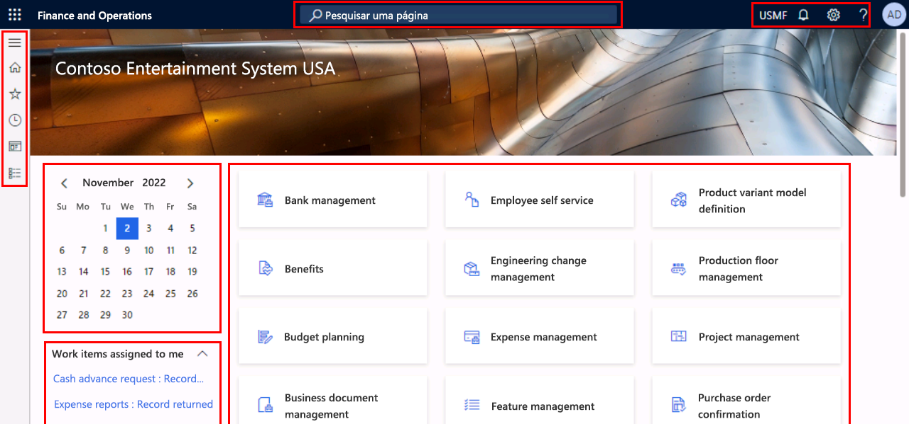
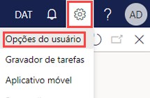
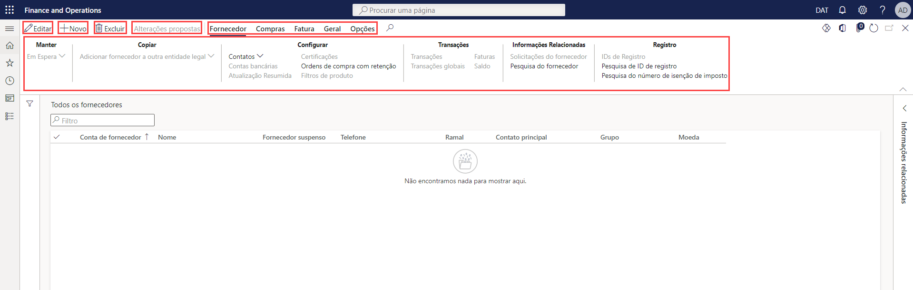
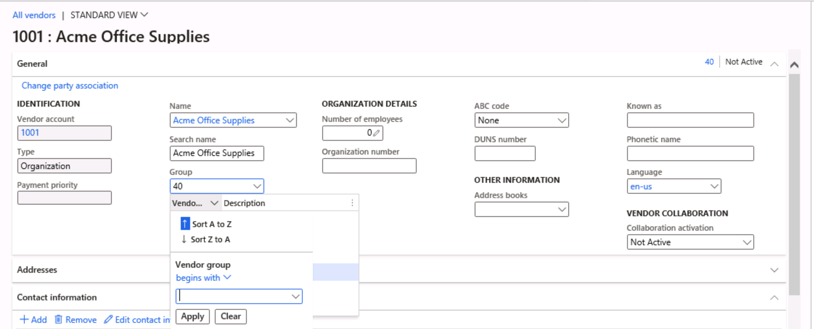

---
lab:
    title: 'Laboratório 1: Navegar por aplicativos de finanças e operações'
    module: 'Módulo 1: Conheça os Princípios básicos do Microsoft Dynamics 365 Supply Chain Management'
---

# Módulo 1: Conheça os Princípios básicos do Dynamics 365 Supply Chain Management

## Laboratório 1 - Navegar por aplicativos de finanças e operações

## Objetivos

Agora que você está familiarizado com os aplicativos de finanças e operações, reserve algum tempo para conhecer a interface.

## Configuração do laboratório

- **Tempo estimado**: 10 minutos

## Instruções

### Entrar no computador do laboratório

1. Entrar no computador do laboratório usando estas credenciais:

    - Nome de usuário:

        Colar conteúdo

        Administrator

    - Senha:

        Colar conteúdo

        pass@word1

    >[!Observação] Pode ser que o Internet Explorer seja aberto automaticamente na área de trabalho. Caso você ainda não tenha executado as etapas 2-5, termine-as antes de voltar para o Internet Explorer.

1. Selecione o arquivo **AdminUserProvisioning** na área de trabalho.

1. Digite as credenciais fornecidas e selecione **Enviar**.  
Suas credenciais podem ser encontradas no menu **Recursos** no canto superior direito da tela.

1. Aguarde a conclusão do script antes de continuar. Isso pode levar de 2 a 3 minutos. Após a conclusão do script, uma caixa pop-up é exibida para confirmar que o usuário Administrador foi atualizado com êxito.

1. Selecione **OK** para continuar.

1. Abra o **Internet Explorer**.

1. Acesse o link especificado: <https://usnconeboxax1aos.cloud.onebox.dynamics.com>

1. Entre usando as credenciais fornecidas no menu **Recursos**.

### Navegar por aplicativos de finanças e operações
1. Na home page do Finance and Operations, se configurada, você verá o seguinte:

    - O menu de navegação à esquerda que fica recolhido por padrão.

    - O logotipo da sua empresa.

    - Os blocos de espaço de trabalho disponíveis para você com base na sua função na organização.

    - Um calendário e itens de trabalho atribuídos a você.

    - Uma Barra de pesquisa que é muito útil para encontrar rapidamente o que for preciso.

    - Na parte superior direita, você encontra a empresa com a qual está trabalhando, notificações, configurações e links de ajuda.  
    Verifique se a empresa listada é **USMF**.

    

1. Na parte superior esquerda, selecione o menu de hambúrguer **Expandir o painel de Navegação**.

1. No painel de navegação, você encontra coleções para seus **Favoritos**, itens **Recentes**, **Espaços de trabalho** e **Módulos**.

1. Selecione **Módulos** > **Administração do sistema** no painel de navegação.

1. Revise as áreas disponíveis no módulo Administração do sistema.

1. Em **Configuração**, selecione **Opções de desempenho do cliente**.

1. No painel de opções de Desempenho do cliente, em **Balões de recursos habilitados**, selecione o interruptor e defina-o para **Sim**.

1. Examine as outras opções disponíveis, role a tela para a parte inferior do painel e selecione **OK**.

1. Na home page, na parte superior direita, selecione o ícone Configurações e, em seguida, Opções do usuário.

    

1. Na página Opções, use as guias para definir outras configurações que serão aplicadas à sua conta.

1. Selecione a guia **Preferências**.

1. Examine as preferências disponíveis. Observe que você pode alterar a visualização de empresa padrão e página inicial que verá quando entrar.

1. Selecione e examine as guias **Conta** e **Fluxo de trabalho**.

1. No menu de navegação à esquerda, selecione o ícone de **Página inicial**.

1. Na página inicial, na parte superior central da página, marque a caixa **Procurar uma página**.

1. Na caixa de pesquisa, procure **Todos os fornecedores**.

1. Talvez seja preciso esperar na primeira vez em que você procurar uma página. Você verá um pequeno círculo girando à direita da caixa de pesquisa durante o processamento da pesquisa.

1. A página Todos os fornecedores é um exemplo de página de listagem. Em geral, a página de listagem contém dados mestres que podem ser lidos, criados, excluídos e atualizados. Para ver mais recursos, use a faixa de opções mostrada acima da lista.

    

1. Destaque um dos fornecedores da lista e, à direita, selecione o menu **Informações relacionadas** e veja as informações adicionais fornecidas.

1. Na lista de fornecedores, selecione **Suprimentos do escritório Acme**. 

1. Selecione o menu **Agrupar** e, em seguida, o título da coluna **Grupo de fornecedores**.

    

1. Muitos menus têm opções de classificação e filtragem disponíveis. Use os filtros para localizar rapidamente o conteúdo de campo que você está procurando.

1. Na parte superior direita, observe a funcionalidade adicional. Mova o mouse para cada item e leia o texto explicativo do recurso. Quando terminar, selecione o ícone **Fechar** para fechar a página e voltar à home page.

    

1. Na parte superior direita, selecione o ícone de ponto de interrogação de **Ajuda** e, em seguida, **Ajuda**.

1. Observe que as informações de ajuda estão relacionadas à página atual.

1. Tente selecionar um bloco de espaço de trabalho e depois examine as informações de ajuda dele. Quando terminar, volte para a home page.
