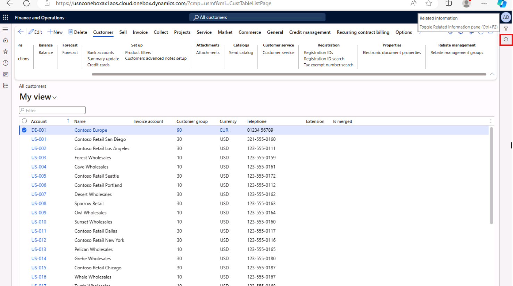

---
lab:
  title: 'Laboratório 1.1: Navegar pelos aplicativos de finanças e operações'
  module: 'Learning Path 1: Explore the core capabilities of Dynamics 365 finance and operations apps'
---

# Roteiro de aprendizagem 1: explorar as principais funcionalidades dos aplicativos de finanças e operações do Dynamics 365
# Módulo 1: Descrever os aplicativos de finanças e operações

## Laboratório 1.1: Navegar pelos aplicativos de finanças e operações

## Objetivo

Agora que você está familiarizado com os aplicativos de finanças e operações, explore a interface por algum tempo.

## Configuração do Laboratório

- **Tempo estimado**: 10 minutos

## Instruções

### Entre no computador do Laboratório

1.  Entre no computador do laboratório usando as credenciais abaixo:

    - Nome de usuário: `Administrator`

    - Senha: `pass@word1`

1.  Este laboratório foi configurado para provisionar automaticamente sua conta de usuário administrador. Depois de concluído, o Edge será aberto automaticamente e solicitará que você se conecte, o que pode ser feito com as credenciais fornecidas encontradas na guia Recursos. Se esse processo falhar, veja a observação abaixo. Caso contrário, você pode avançar no laboratório. 

    >Na área de trabalho, clique duas vezes em AdminUserProvisioning.
No campo Endereço de email, insira o nome de usuário em **Recursos** e clique em Enviar.
Aguarde o prompt para avisar o usuário administrador atualizado para... e clique em OK.   

1.  O **Microsoft Edge** abrirá a URL do Finance and Operations:<https://usnconeboxax1aos.cloud.onebox.dynamics.com>

1.  Entre usando o nome de usuário e a senha fornecidos no menu **Recursos**. 

### Navegue por aplicativos financeiros e operacionais

Agora que você está familiarizado com os aplicativos de finanças e operações, dedique algum tempo para explorar as interfaces.

1.  Se a **página Inicial Finanças e Operações** estiver configurada, você verá:

    - O menu de navegação na esquerda que está recolhido por padrão.

    - O logotipo da sua empresa.

    - Tiles do Workspace disponíveis para você com base na sua função na organização.

    - Um calendário e itens de trabalho atribuídos a você.

    - A barra de pesquisa que é muito útil para encontrar o que você precisa de maneira rápida.

    - No canto superior direito, você vê a empresa com a qual você está trabalhando, notificações, configurações e links de ajuda. Verifique se a empresa listada é **USMF**.

    
2.  No canto superior esquerdo, selecione o menu hambúrguer **Expandir o painel de navegação**.

3.  O painel de navegação é aonde você encontrará coleções para os seus itens **Favoritos**, **Recente**, **Workspaces** e **Módulos**.

4.  No painel de navegação, selecione **Módulos** > **Administração do sistema**.

5.  Revise as áreas disponíveis no módulo de administrador do sistema.

6.  Em **Configuração**, selecione **Opções de desempenho do cliente**.

7.  No painel **Opções de desempenho do cliente**, em **Avisos de recursos habilitados**, selecione o interruptor e defina-o para **Sim**.

8.  Revise as outras opções disponíveis, desça até o final do painel e selecione **OK**.

9.  Na **página inicial**, no canto superior direito, clique no ícone **Configurações** e selecione **Opções de usuário**.

    

10. Na página **Opções**, use as guias para definir diferentes configurações a serem aplicadas à conta.

11. Selecione a guia **Preferências**.

12. Revise as preferências disponíveis. Observe que você pode alterar a empresa padrão e a página inicial ao entrar.

13. Selecione e revise as guias **Conta** e **Fluxo de trabalho**.

14. No menu Navegação à esquerda, selecione o ícone **Início**.

15. Na **página Inicial**, na parte superior central, clique na caixa **Pesquisar uma página**.

16. Na caixa de pesquisa, pesquise por **Todos os clientes**.

17. Selecione a página **Contas a receber** > **Clientes** > **Todos os clientes**. 

18. Você pode precisar esperar a primeira vez que você pesquisar um página. Você verá um pequeno círculo giratório à direita da caixa de pesquisa durante o processo de pesquisa.

19. A **página Todos os clientes** é um exemplo de página de lista. A página de lista contém dados mestres que podem ser lidos, criados, excluídos e atualizados. Mais recursos estão disponíveis na faixa de opções acima da lista.

    

20. Destaque um dos clientes da lista e, à direita, selecione o menu **Informações relacionadas** e revise as informações fornecidas.

    

21. Na lista **Clientes**, clique em **Contoso Retail San Diego**.

22. Selecione o menu **Grupo**, e, em seguida, selecione o título da coluna **Grupo de clientes**.

    

23. Muitos menus têm a função classificar e filtrar habilitadas. Use os filtros para localizar o conteúdo do campo que você está buscando.

24. No canto superior direito, observe a funcionalidade adicional. Leve seu mouse até cada item e revise o aviso do recurso. Ao final, clique no ícone **Fechar** para fechar a página e voltar à **página inicial**.

    

