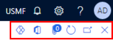

---
lab:
  title: 'Laboratório 1: Navegue por aplicativos financeiros e operacionais'
  module: 'Module 1: Explore the core capabilities of Dynamics 365 finance and operations apps'
---

# Módulo 1: Explorar as principais funcionalidades dos aplicativos de finanças e operações do Dynamics 365

## Laboratório 1: Navegue por aplicativos financeiros e operacionais

## Objetivo

Agora que você está familiarizado com os aplicativos de finanças e operações, explore a interface por algum tempo.

## Configuração do Laboratório

- **Tempo estimado**: 10 minutos

## Instruções

### Entre no computador do Laboratório

1.  Entre no computador do laboratório usando as credenciais abaixo:

    - Nome de usuário: `Administrator`

    - Senha: `pass@word1`

1.  Aguarde o script AdminUserProvisioning ser concluído antes de continuar. Isso pode levar de 2 a 3 minutos. Assim que o script estiver concluído uma caixa pop-up será exibida brevemente para confirmar que o usuário administrador foi atualizado com sucesso. 

1.  O **Microsoft Edge** abrirá a URL do Finance and Operations:<https://usnconeboxax1aos.cloud.onebox.dynamics.com>

1.  Entre usando o nome de usuário e a senha fornecidos no menu **Recursos**. 

### Navegue por aplicativos financeiros e operacionais

1.  Na **página inicial de finanças e operações**, você verá: 

    -  O menu de navegação na esquerda que está recolhido por padrão. 

    - A imagem de faixa padrão da empresa. 

    - Tiles do Workspace disponíveis para você com base na sua função na organização. 

    - Um calendário e itens de trabalho atribuídos a você. 

    - A barra de **Pesquisar uma página** que é muito útil para encontrar o que você precisa de maneira rápida. 

    - No canto superior direito, você vê a empresa com a qual você está trabalhando, notificações, configurações e links de ajuda. 

    

1.  Verifique se a empresa listada é **USMF**. 

1.  No canto superior esquerdo, selecione o menu hambúrguer **Expandir o painel de navegação**. 

1.  O painel de navegação é aonde você encontrará coleções para os seus itens **Favoritos**, **Recente**, **Workspaces**, e **Módulos**. 

1.  No painel de navegação, selecione **Módulos** > **Administração do sistema**. 

1.  **Examine** as diferentes áreas disponíveis no módulo **Administrador do sistema**. 

1.  Em **Configuração**, selecione **Opções de desempenho do cliente**. 

1.  No painel de opções de Desempenho do cliente, em **Avisos de recursos habilitados**, selecione o interruptor e defina-o para **Sim**. 

1.  Examine as outras opções disponíveis, desça até o final do painel e selecione **OK**. 

1.  Na página inicial, no canto superior direito, clique no ícone **Configurações** e selecione **Opções de usuário**. 

    

1.  Na página **Opções do usuário**, use as guias para definir diferentes configurações a serem aplicadas à conta. 

1.  Selecione a guia **Preferências**. 

1.  Revise as preferências disponíveis. Você pode alterar a os campos **Empresa** e **Página inicial** padrão que você verá ao entrar. 

1.  Selecione e revise as guias **Conta** e **Fluxo de trabalho**. 

1.  No menu Navegação à esquerda, selecione o ícone **Início**. 

1.  Na página Inicial, na parte superior no centro da página, selecione a caixa **Pesquisar uma página**. 

1.  Na caixa de pesquisa, pesquise `All vendors` 

1.  Você pode precisar esperar a primeira vez que você pesquisar um página. Você verá um pequeno círculo giratório à direita da caixa de pesquisa enquanto a pesquisa é processada. 

1.  Selecione o primeiro resultado **Todos os fornecedores**, isso é o mesmo que navegar até **Módulos** > **Contas a pagar** > **Fornecedores** > **Todos os fornecedores**. 

1.  A página **Todos os fornecedores** é um exemplo de página de lista. A página de lista geralmente contém dados mestres que podem ser lidos, criados, excluídos e atualizados. Você verá funções adicionais disponíveis usando o painel de ação acima da lista. 

    

1.  Destaque um dos fornecedores da lista e, à direita, selecione o painel de FactBox **Informações relacionadas** à direita, e examine as informações adicionais fornecidas. 

1.  Na lista de fornecedores, abra o registro **Acme Office Supplies**. 

1.  Selecione **Editar** no painel de ações e, em seguida, no campo **Grupo**, selecione o menu suspenso o título de coluna **Grupo de fornecedores**. 

    

1.  Muitos menus têm a função **classificar** e **filtrar** disponíveis. Use os filtros para localizar o conteúdo do campo que você está buscando. Se você já souber o valor, poderá simplesmente inseri-lo no campo, em vez de usar o menu suspenso. 

1.  À direita do painel de ações, observe a funcionalidade adicional. Passe o mouse sobre cada item e examine o texto explicativo do recurso. 

1.  Selecione o ícone **Fechar** para fechar esse registro e retornar à página de lista **Todos os fornecedores**. 

    

1.  No canto superior direito, selecione o ícone de ponto de interrogação **?** e **Ajuda**. 

1.  O painel de informações de ajuda está mostrando o conteúdo da página atual. **Feche** o painel de ajuda. 

1.  Retorne ao **painel padrão** usando o botão **Finance and Operations** na parte superior esquerda ou no ícone **Página Inicial** no menu de navegação à esquerda. 

    > **Observação:** atalho de teclado: Alt+Shift+Home. O Dynamics 365 Finance and Operations dá suporte a muitos atalhos de teclado para acelerar o acesso ao sistema: https://learn.microsoft.com/en-us/dynamics365/fin-ops-core/fin-ops/get-started/shortcut-keys

1.  Tente selecionar um **bloco do workspace** e, em seguida, examine as informações de ajuda para esse workspace. Quando tiver concluído, retorne ao painel Padrão. 

