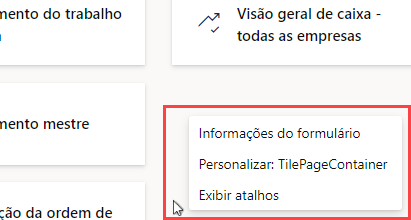
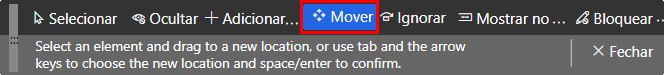
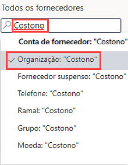
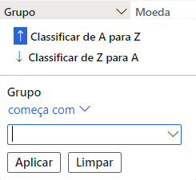
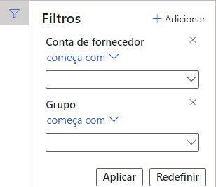
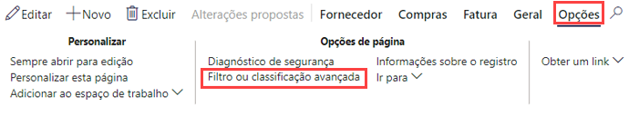
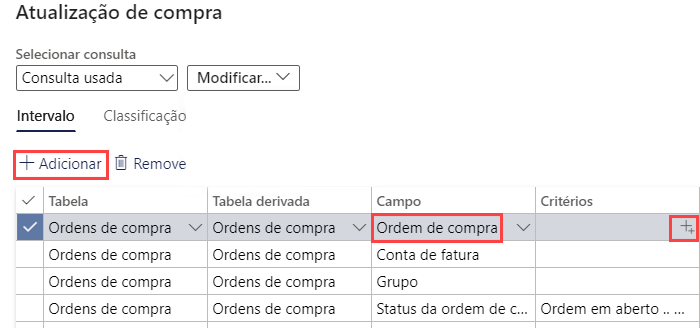
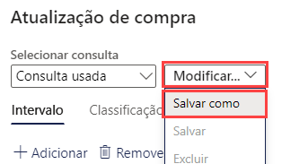

---
lab:
    title: 'Laboratório 2: Explorar os espaços de trabalho e a filtragem'
    module: 'Módulo 1: Conheça os Princípios básicos do Microsoft Dynamics 365 Supply Chain Management'
---

# Módulo 1: Conheça os Princípios básicos do Dynamics 365 Supply Chain Management

## Laboratório 2 - Explorar os espaços de trabalho e a filtragem

## Objetivos

Quando você entra no Finance and Operations pela primeira vez, encontra muitos espaços de trabalho integrados disponíveis. Você também pode criar seu próprio espaço de trabalho com conteúdo focado em uma necessidade existente. Espaços de trabalho são um dos muitos recursos do Dynamics 365, mas você também precisa saber que a filtragem é a única forma de realmente acessar os itens específicos procurados. É preciso criar um novo espaço de trabalho personalizado e usar a filtragem para identificar os diferentes itens necessários.

## Configuração do laboratório

   - **Tempo estimado**: 10 minutos

## Instruções

1. Na home page do Finance and Operations, à direita dos blocos do espaço de trabalho, clique com o botão direito do mouse em uma área em branco (ou toque e mantenha pressionado) para abrir o menu.

    

1. No menu, selecione **Personalizar: TilePageContainer**.

1. Na janela Personalizar, selecione **+ Adicionar um espaço de trabalho**.

1. Se a pequena janela Personalizar não estiver visível, tente rolar a tela para cima na home page e clique com o botão direito do mouse (ou toque e mantenha pressionado) e, em seguida, selecione **Personalizar: TilePageContainer** de novo.

    

1. Na home page, role a tela para baixo e localize o novo bloco **Meu espaço de trabalho 1**.

    

1. Clique com o botão direito do mouse (ou toque e mantenha pressionado) no bloco e depois selecione **Personalizar: Meu espaço de trabalho 1**.

1. Na janela Personalizar, renomeie Meu espaço de trabalho 1 como **Meu espaço de trabalho** e depois selecione **Personalizar esta página**.  
    A alteração do nome será salva automaticamente.

1. Na barra de ferramentas recém-aberta, selecione **Mover**.

    

1. Selecione seu bloco **Meu espaço de trabalho** e depois mova-o para outro local na home page.

    >[!Observação] Se você não conseguir mover o bloco, atualize a página e repita as etapas anteriores para movê-lo.

1. Feche a barra de ferramentas.

1. Na home page, na caixa **Procurar uma página**, procure e selecione **Todos os fornecedores**.

1. Na página Todos os fornecedores, no menu superior, selecione **Opções** > **Adicionar ao espaço de trabalho**.

1. Na caixa de filtros **Espaço de trabalho**, digite **Meu espaço de trabalho** e depois selecione o espaço de trabalho.

1. Selecione o menu Apresentação, veja as opções disponíveis e, em seguida, selecione **Bloco**.

1. Ao concluir, selecione **Configurar**.

1. No painel Adicionar como bloco, verifique o nome do bloco e, em seguida, selecione **OK**.

1. No painel de navegação à esquerda, selecione o ícone de **Página inicial**.

1. Na home page, selecione seu novo espaço de trabalho.

1. Na página Meu espaço de trabalho, verifique se o bloco recém-adicionado Fornecedores é mostrado.

1. Selecione o bloco **Fornecedores**.

1. Na página Todos os fornecedores, na caixa **Filtro**, digite **Contoso**.

1. Examine os diferentes campos que podem ser usados para encontrar Contoso.

    

1. Selecione **Nome: "Contoso"** e depois verifique os resultados do filtro.

1. Desmarque a caixa de filtro e depois pressione Enter para mostrar todos os fornecedores.

1. Selecione o título da coluna **Grupo**.

    

1. Use esse recurso para classificar os grupos de modo ascendente (Classificar de A a Z) ou descendente (Classificar de Z a A).

1. Em **Grupo**, selecione o menu **começa com** e examine os operadores de comparação. Selecione **é exatamente**.

1. Selecione o menu abaixo **é exatamente** e, em seguida, selecione **Outros fornecedores**.  
    Se preferir, insira um valor no campo de menu.

1. Selecione **Aplicar** e depois veja os resultados. Observe o ícone de filtro no cabeçalho da coluna Grupo.

    

1. Selecione a coluna **Grupo** e, em seguida, no menu de filtro, selecione **Limpar**.

1. À esquerda do título Todos os fornecedores, selecione o ícone Filtro.

    

1. Na parte superior direita do painel Filtro, selecione **+ Adicionar**.

1. No painel de campos Adicionar filtro, marque a caixa de seleção à esquerda do **Grupo** e selecione Atualizar.

1. Observe o outro filtro que foi adicionado. Com isso, você poderá filtrar a lista com base em mais de um critério.

    

1. No filtro **Conta de fornecedor começa com**, selecione o menu e depois **Northwind Traders**.

1. No filtro **Grupo começa com**, selecione o menu e depois **30**.

1. Selecione **Aplicar** e depois examine os resultados do filtro.

1. No painel Filtros, selecione **Redefinir** e observe que o filtro adicional foi removido e o filtro padrão foi redefinido como um valor vazio.

1. Na barra da faixa de opções, selecione **Opções** e, em seguida, nas seções de opções de páginas, selecione **Filtro ou classificação avançada**.

    

1. Na janela Consulta - Fornecedores, selecione **+ Adicionar**.

1. Na nova linha, na célula Campo, selecione o menu e depois **Grupo**.

1. Se preferir, selecione o menu, comece a digitar o nome do grupo e depois selecione-o nos resultados do filtro.

1. Na célula Critério, selecione o ícone **Abrir**.

    

1. Na lista Grupo de fornecedores, selecione **30 outros fornecedores**.

1. Para salvar a nova consulta, em **Selecionar consulta**, selecione o menu **Modificar** e, em seguida, **Salvar como**.

    

1. No painel Salvar consulta, na caixa **Nome**, digite Minha consulta e depois selecione **OK**.

1. Na página Consulta - Fornecedores, selecione **OK**.

1. Verifique se a lista reflete os resultados da consulta recém-criada.

1. Para remover o filtro, selecione **Filtro ou classificação avançada** e, em seguida, na página Consulta - Fornecedores, selecione **Redefinir** e depois selecione **OK**.

1. Com isso, a consulta será redefinida, a consulta salva não será excluída.
