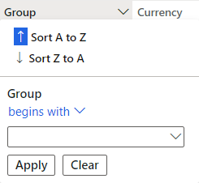

---
lab:
  title: 'Laboratório 2: Explorar espaços de trabalho e filtros'
  module: 'Module 1: Learn the Fundamentals of Microsoft Dynamics 365 Supply Chain Management'
ms.openlocfilehash: 0a2815e312b9798dcf93ec6cee669eb65a1f9942
ms.sourcegitcommit: 252458fca8e71b6e5e8b99ae4c2b47cd85461a30
ms.translationtype: HT
ms.contentlocale: pt-BR
ms.lasthandoff: 01/27/2022
ms.locfileid: "137909348"
---
# Módulo 1: Conheça os Princípios básicos do Microsoft Dynamics 365 Supply Chain Management

## Laboratório 2 – Explorar workspaces e filtragem

## Objetivos

Você tem à disposição muitos workspaces internos ao entrar pela primeira vez em Finanças e Operações. Também é possível criar seu próprio workspace com conteúdo focalizado em uma necessidade que você possa ter. Os workspaces são um dos muitos recursos do Dynamics 365, mas saiba que a filtragem é a maneira de realmente obter os itens específicos que pode estar procurando. Você deve criar um novo workspace personalizado e usar a filtragem para identificar os diferentes itens de que precisa.

## Configuração do Laboratório

   - **Tempo estimado**: 10 minutos

## Instruções

1. Na página inicial Finanças e Operações, à direita dos blocos do workspace, clique com o botão direito do mouse ou mantenha pressionada uma área em branco para executar o menu.

    

1. No menu, selecione **Personalizar: TilePageContainer**.

1. Na janela Personalizar, selecione **+Adicionar um workspace**.

1. Se a janela pequena Personalizar não aparecer, experimente rolar para cima na Página inicial e clique com o botão direito ou mantenha pressionado e selecione **Personalizar: TilePageContainer** novamente.

    

1. Na Página inicial, role para baixo e localize o novo bloco **Meu workspace 1**.

    

1. Clique com o botão direito ou mantenha pressionado e selecione **Personalizar: Meu workspace 1**.

1. Na janela Personalizar, renomeie Meu workspace 1 para **Meu workspace** e selecione **Personalizar esta página**.  
    A alteração de nome será salva automaticamente.

1. Na barra de ferramentas aberta recentemente, selecione **Mover**.

    

1. Selecione o bloco **Meu workspace** e mova-o para outro local na Página inicial.

    >[!Note] Se não for possível mover o bloco, atualize a página e repita as etapas anteriores para mover o bloco.

1. Feche a barra de ferramentas.

1. Na Página inicial, na caixa **Pesquisar por uma página**, procure e selecione **Todos os fornecedores**.

1. Na página Todos os fornecedores, no menu superior, selecione **Opções** > **Adicionar ao workspace**.

1. Na caixa de filtro **Workspace**, insira **Meu workspace** e selecione o workspace.

1. Selecione o menu Apresentação, examine as opções disponíveis e selecione **Bloco**.

1. Quando concluir, selecione **Configurar**.

1. No painel Adicionar como bloco, verifique o nome do bloco e selecione **OK**.

1. No painel de navegação esquerdo, selecione o ícone **Página inicial**.

1. Na Página inicial, selecione seu novo workspace.

1. Na página Meu workspace, verifique se aparece o bloco Fornecedores, adicionado recentemente.

1. Selecione o bloco **Fornecedores**.

1. Na página Todos os fornecedores, na caixa **Filtro**, digite **Contoso**.

1. Examine os diferentes campos que podem ser usados para encontrar a Contoso.

    

1. Selecione **Nome: “Contoso”** e verifique os resultados do filtro.

1. Desmarque a caixa de filtro e pressione Enter para mostrar todos os fornecedores.

1. Selecione o título da coluna **Grupo**.

    

1. Isso pode ser usado para classificar os grupos do menor para o maior (Classificar de A a Z) ou do maior para o menor (Classificar de Z a A).

1. Em **Grupo**, selecione o menu **Inicia com** e examine os operadores de comparação. Select **é exatamente**.

1. Selecione o menu abaixo **é exatamente** e depois **Outros fornecedores**.  
    Como alternativa, você pode inserir um valor no campo de menu.

1. Selecione **Aplicar** e examine os resultados. Observe o ícone de filtro no cabeçalho da coluna Grupo.

    

1. Selecione a coluna **Grupo** e, no menu filtrar, selecione **Limpar**.

1. À esquerda do título Todos os fornecedores, selecione o ícone de Filtro.

    

1. No canto superior direito do painel Filtro, selecione **+Adicionar**.

1. No painel Adicionar campos de filtro, marque a caixa de seleção à esquerda do **Grupo** e selecione Atualizar.

1. Observe o filtro adicional que foi adicionado. Isso permitirá que você filtre a lista com base em mais de um critério.

    

1. No filtro **A conta do fornecedor começa com**, selecione o menu e depois **Northwind Traders**.

1. No filtro **O grupo começa com**, selecione o menu e depois **30**.

1. Selecione **Aplicar** e examine os resultados do filtro.

1. No painel Filtros, selecione **Redefinir** e observe que o filtro adicional foi removido e o filtro padrão foi redefinido para um valor vazio.

1. Na barra Faixa de Opções, selecione **Opções** e, em seguida, nas seções Opções de página, selecione **Filtro avançado ou classificar**.

    

1. Na janela Consultas – Fornecedores, selecione **+ Adicionar**.

1. Na nova linha, na célula Campo, selecione o menu e depois **Grupo**.

1. Como alternativa, você pode selecionar o menu, começar a digitar o nome do grupo e, em seguida, selecioná-lo nos resultados do filtro.

1. Na célula Critérios, selecione o ícone **Abrir**.

    

1. Na lista Grupo de fornecedores, selecione **outros 30 fornecedores**.

1. Para salvar a nova consulta, em **Selecionar consulta**, selecione o menu **Modificar** e, em seguida, selecione **Salvar como**.

    

1. No painel Salvar consulta, na caixa **Nome**, insira Minha consulta e depois **OK**.

1. Na página Consulta – Fornecedores, selecione **OK**.

1. Verifique se a lista reflete os resultados da consulta recém-criada.

1. Para remover o filtro, selecione **Filtro avançado ou classificar** e, na página Consultas – Fornecedores, selecione **Redefinir** e **OK**.

1. Isso redefinirá a consulta, mas não excluirá a consulta salva.
