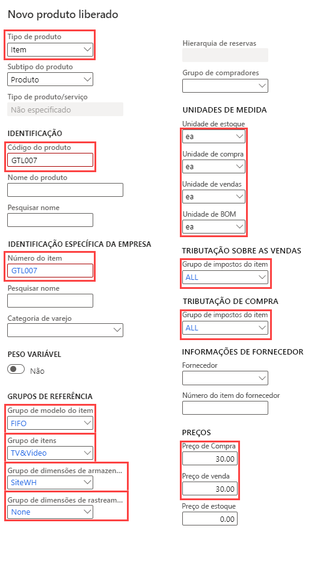
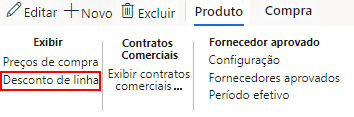

---
lab:
    title: 'Laboratório 3: Criar uma oferta de produto com vários tamanhos e cores'
    module: 'Módulo 1: Conheça os Princípios básicos do Microsoft Dynamics 365 Supply Chain Management'
---

# Módulo 1: Conheça os Princípios básicos do Microsoft Dynamics 365 Supply Chain Management

## Laboratório 3 – Criar um produto novo

## Objetivos

Em Contoso Entertainment System USA (USMF), é preciso criar um novo item para que uma nova configuração de gabinete seja comprada de fornecedores.

## Configuração do laboratório

   - **Tempo estimado**: 10 minutos

## Instruções

1. Na home page do Finance and Operations, na parte superior direita, verifique se você está trabalhando com a empresa USMF.

1. Se necessário, selecione a empresa e, no menu, selecione **USMF**.

1. No canto superior esquerdo, selecione o menu hambúrguer **Expandir o painel de navegação**.

1. No painel de navegação, selecione **Módulos** > **Gerenciamento de informações do produto,** e na categoria **Produtos**, selecione **Produtos liberados**.

1. Na página de Detalhes do produto liberado, no menu superior, selecione **+ Novo**.

1. No painel de Novos produtos liberados, no menu **Tipo de produto**, verifique se o **Item** está selecionado.

1. No menu **Subtipo do produto**, verifique se o **Produto** está selecionado.

1. Selecione o menu **Grupo de dimensões de rastreamento**, e selecione **Nenhum**.

1. Em **IDENTIFICAÇÃO**, nas caixas **Número do produto** e **Número do item**, digite **GTL007**.

1. Na caixa **Nome do produto**, digite **Gabinete 2**.

1. Em **GRUPOS DE REFERÊNCIA**, selecione o menu **Grupo de modelo do item**, e selecione **PEPS Primeiro a Entrar, Primeiro a Sair**.

1. Selecione o menu **Grupo do item** e selecione **TV e Vídeo**.

1. Selecione o menu **Grupo de dimensões de armazenamento**, e selecione **SiteWH**.

1. Em **UNIDADES DE MEDIDA**, verifique se foram definidos os seguintes valores:

    | **Configuração**| **Valor**|
    | :--- | :--- |
    | Unidade de inventário| ea Cada|
    | Unidade de compra| ea Cada|
    | Unidade de vendas| ea Cada|
    | Unidade de BOM| ea Cada|

1. Em **TRIBUTAÇÃO SOBRE AS VENDAS**, selecione o menu **Grupo de impostos do item** e selecione **TODOS**.

1. Em **TRIBUTAÇÃO DE COMPRA**, selecione o menu **Grupo de impostos do item** e selecione **TODOS**.

1. Em PREÇOS, na caixa de preço da Compra, digite 30,00.

1. Na caixa de preço da Venda, digite 30,00.

1. O novo produto liberado terá uma aparência semelhante à seguinte:

    

1. Selecione **OK**.

1. Para garantir que o produto foi finalizado, na barra de faixa de opções, em **Manter**, selecione **Validar**.

    

1. Verifique se você recebeu a mensagem com a informação que confirma que todos os valores dos campos exigidos foram validados.

    

1. Feche todas as páginas e volte para a Home page.
