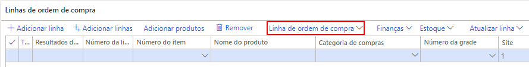

---
lab:
    title: 'Laboratório 4: Criar uma ordem de compra'
    module: 'Módulo 1: Conheça os Princípios básicos do Microsoft Dynamics 365 Supply Chain Management'
---

# Módulo 1: Conheça os Princípios básicos do Dynamics 365 Supply Chain Management

## Laboratório 4 - Criar uma ordem de compra

## Objetivos

É mais comum que as ordens de compra sejam criadas automaticamente como resultado de um planejamento mestre, entrega direta e outros processos. Quando criada manualmente, em geral, isso é feito por um agente de compras. Use a empresa USMF para criar uma ordem de compra.

## Configuração do laboratório

   - **Tempo estimado**: 10 minutos

## Instruções

1. Na home page do Finance and Operations, na parte superior direita, verifique se você está trabalhando com a empresa USMF.

1. Se necessário, selecione a empresa e, no menu, selecione **USMF**.

1. Na parte superior esquerda, selecione o menu de hambúrguer **Expandir o painel de Navegação**.

1. Selecione **Módulos** > **Compras e fornecimento** > **Ordens de compra** > **Todas as ordens de compra**.

1. Na página Todas as ordens de compra, no menu superior, selecione **+ Nova**.

1. No painel Criar ordem de compra, selecione o menu **Conta de fornecedor** e, em seguida, **US-101**.

1. Quando você seleciona um fornecedor, os detalhes de registro de fornecedor, como endereço, conta de fatura, condições de entrega e modo de entrega, são copiados como valores padrão para o cabeçalho da ordem. Você pode alterar esses valores a qualquer momento.

1. Expanda a seção **Geral**.

1. Em **DIMENSÕES DE ARMAZENAMENTO**, selecione o menu **Local** e examine a lista de locais.

1. Os campos Local e Depósito especificam onde os bens ou serviços adquiridos devem ser entregues. O endereço de entrega padrão é o local. Ambos os campos podem ser preenchidos com valores configurados para o fornecedor selecionado ou você pode especificá-los manualmente.

1. Em **DATAS**, o campo Data de entrega é usado para especificar quando os bens e serviços adquiridos precisam ser entregues.

1. É possível especificar uma única data de entrega para a ordem ou as linhas da ordem separadas podem receber datas de entrega exclusivas. Se a data de entrega especificada aqui não for viável para determinados produtos e serviços por terem prazos de entrega mais longos, essas linhas serão criadas com uma data de entrega posterior.

1. Expanda a seção **Administração**. A caixa **Autor da ordem** pode ser usada para especificar quem está fazendo o pedido.

1. Talvez esse seja um método prático de compartilhar com o fornecedor caso precise entrar em contato com essa pessoa. O valor poderá ser atribuído automaticamente se a conta de usuário atual estiver associada a um nome na página Usuários.

1. Selecione **OK**.

1. O cabeçalho da ordem foi criado. Quando você trabalha com linhas de ordem de compra, somente um resumo das informações de cabeçalho é mostrado. Se você precisar ver o restante das informações, selecione **Cabeçalho**.

    

1. Em **Linhas de ordem de compra**, no menu, selecione **Linha de ordem de compra**.

    

1. Em **EXIBIR**, selecione **Dimensões**.

1. Os produtos podem estar em variáveis diferenciadas por dimensões, como cor, tamanho ou estilo. Os produtos também podem ser configurados para usar dimensões de armazenamento, como local e depósito. Essas também são dimensões de rastreamento opcionais, como números de lote e série. Para aumentar a eficiência da entrada da ordem, adicione os campos de dimensão que você em geral usa diretamente na grade da ordem.

1. No painel Mostrar dimensões, em **DIMENSÕES DO PRODUTO**, marque a caixa de seleção **Cor**.

1. Opcional: Se você selecionar o botão de alternância Salvar configuração, as dimensões escolhidas também serão mostradas na grade de linhas da ordem na próxima vez que você abrir a página da ordem de compra.

1. Selecione **OK**.

1. Selecione o menu de célula **Número do item** e depois selecione **T0004**.

1. Lembre-se de que você também pode digitar na caixa de filtro, em vez de percorrer a lista.

1. As linhas da ordem são criadas para produtos e serviços com a especificação de um número de item ou como despesas pela determinação de uma categoria de compras.

1. A categoria de compras é usada para a adição de linhas em que os itens comprados são contabilizados como despesas diretamente, em vez de entrar no estoque. Isso significa que se for preciso contabilizar uma compra como despesa, você poderá fazer isso criando uma linha de ordem de compra que especifica uma categoria de compras, em vez de criar uma linha com um número de item. Também é possível associar os itens a uma categoria de compras e, nesse caso, essa categoria é mostrada apenas para fins informativos.

1. Selecione o menu **Cor**, examine as opções disponíveis e selecione uma das cores ou combinações de cores.

1. As opções Local e Depósito geralmente são preenchidas com valores do cabeçalho da ordem, mas será possível substituir os campos se for preciso entregar algumas linhas em locais diferentes.

1. No campo **Quantidade**, digite **10**.

1. A Quantidade é preenchida automaticamente com a quantidade mínima do pedido do produto, caso esteja configurado, ou com o valor de 1.

1. Algumas informações adicionais:

    - **Unidade**: Indica a unidade de medida da quantidade solicitada. Em geral, a unidade é fornecida automaticamente com base na unidade de compra nos dados mestres do produto.

    - **Preço unitário**: Contém um valor de um contrato de compra ou contrato comercial. É possível alterar o preço unitário nas linhas da ordem separadas — por exemplo, se um preço unitário for negociado com o fornecedor.

    - **Desconto**: Representa o valor de um desconto por unidade. O desconto reduz o preço unitário. Em geral, esse desconto é fornecido automaticamente com base nos contratos de compra ou contratos comerciais, mas será possível substituí-lo nas linhas separadas se descontos exclusivos tiverem sido negociados com o fornecedor.

    - **Percentual de desconto**: Quando especificado, reduz o valor líquido da linha. Com frequência, esse percentual é fornecido automaticamente com base nos contratos de compra ou contratos comerciais, mas será possível substituí-lo nas linhas separadas se um percentual exclusivo tiver sido negociado com o fornecedor.

    - **Valor líquido**: Calculado com base nos outro campos na linha, inclusive quantidade, preço unitário, desconto e percentual de desconto. É possível alterar o Valor líquido, mas os campos Preço unitário, Desconto e Percentual de desconto ficarão em branco, e quando você lançar na linha, o valor lançado será proporcional ao valor líquido. Em geral, o campo Valor líquido só será usado para exibição do valor líquido da linha.

1. Nas linhas da ordem de compra, na parte inferior da página, selecione **Detalhes da linha**.

1. Selecione a guia **Entrega**.

1. Uma data de entrega única pode ser atribuída a cada linha da ordem. A data é herdada do campo no cabeçalho da ordem de compra, mas você pode mudar isso.

1. Feche a página Linha da ordem de compra.

1. Na página Todas as ordens de compra, use o recurso Filtro e procure sua nova ordem de compra.

1. Quando terminar, feche a página Todas as ordens de compra e volte para a home page.
