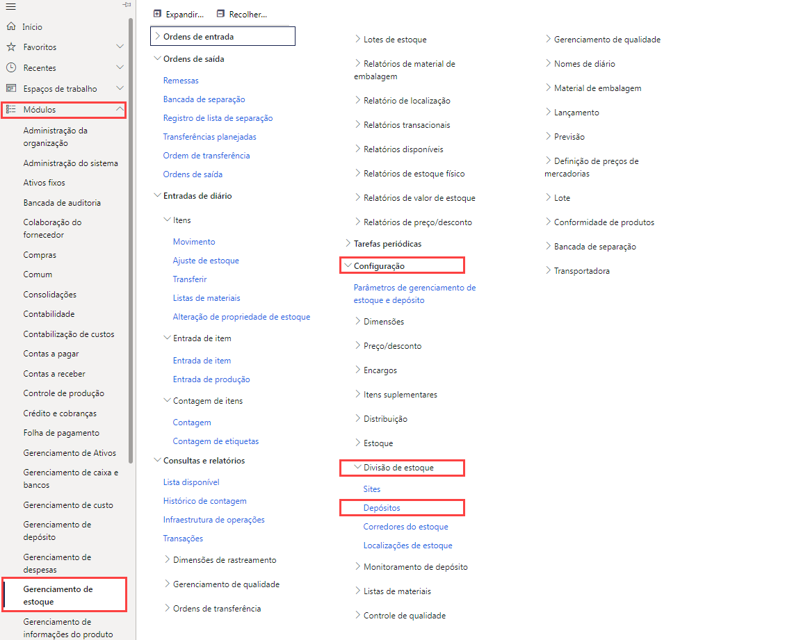

---
lab:
    title: 'Laboratório 5: Criar um depósito'
    module: 'Módulo 1: Conheça os Princípios básicos do Microsoft Dynamics 365 Supply Chain Management'
---

# Módulo 1: Conheça os Princípios básicos do Dynamics 365 Supply Chain Management

## Laboratório 5 - Criar um depósito

## Objetivos
O sistema de gerenciamento de depósito no Supply Chain Management oferece maneiras flexíveis de definir o layout do seu depósito para atender às necessidades em constante mudança. Assim, você pode obter a eficiência máxima no depósito

- É possível estabelecer áreas de armazenamento de alta ou baixa prioridade para o posicionamento ideal de mercadorias.
- Você pode dividir o depósito em zonas para atender a várias necessidades de armazenamento, como requisitos de temperatura ou taxas de renovação variadas para itens.
- É possível especificar locais de depósito em qualquer nível (por exemplo, site, depósito, corredor, rack, prateleira e posição de compartimento).
- Você pode agrupar locais usando configurações de restrição de capacidade física.
- Também pode controlar como os itens são armazenados e selecionados, com base nas regras definidas para consultas.

Para usar o gerenciamento de depósito no Supply Chain Management, é preciso criar um depósito e habilitá-lo para atividades de gerenciamento de depósito mais avançadas ou especializadas.

## Configuração do laboratório

   - **Tempo estimado**: 10 minutos

## Instruções

1. Na home page do Finance and Operations, na parte superior direita, verifique se você está trabalhando com a empresa USMF.

1. Se necessário, selecione a empresa e, no menu, selecione **USMF**.

1. No painel de navegação à esquerda, selecione **Módulos** > **Gerenciamento de estoque** > **Configuração** > **Divisão de estoque** > **Depósitos**.

    

1. Na página Depósitos, no menu superior, selecione **Novo**.

1. No campo **Depósito**, digite **101**.

1. No campo **Nome**, digite **Estouro de depósito**.

1. Selecione o menu do **Site** e, em seguida, **3 Produção de espuma para casa**.

1. Expanda **Nomes de localização**.  
    As opções nessa seção definem o formato padrão para nomes de localização.

1. Defina as opções **Incluir corredor** e **Incluir rack** como **Sim**.

1. Na caixa **Formatar**, digite um valor para o rack.  
    Por exemplo, se o formato do nome de localização do rack tiver que ter OVFL, insira esse valor na caixa Formatar.

1. Em **NÍVEL**, defina a opção **Incluir prateleira** como **Sim**.

1. No campo **Formatar**, para a prateleira, digite **-##**.

1. No menu superior, selecione **Depósito**.

    

1. Em **Manter**, selecione **Assistente de Localização**.

1. Na página de boas-vindas, leia as informações e, em seguida, no canto inferior direito, selecione **Avançar**.

1. Desmarque as caixas de seleção **Docas de saída** e **Locais de massa**.

1. Selecione **Avançar** e examine as informações.

1. Acesse cada página e, quando terminar, selecione **Concluir**.

1. Feche a página e volte para a home page.
