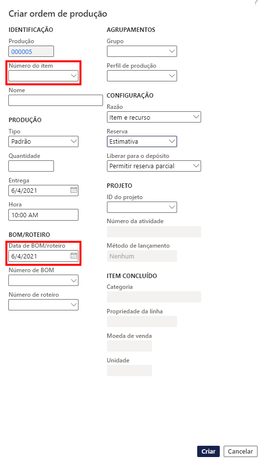

---
lab:
    title: 'Laboratório 6: Criar uma ordem de produção'
    module: 'Módulo 1: Conheça os Princípios básicos do Microsoft Dynamics 365 Supply Chain Management'
---

## Laboratório 6 - Criar uma ordem de produção

## Objetivos

A ordem de produção contém informações sobre o que será produzido, a quantidade de produção e a data de término planejada. Também contém informações sobre quais materiais consumir e quais processos seguir para produzir o item.

Você deve criar uma nova ordem de produção para sua empresa.

## Configuração do laboratório

   - **Tempo estimado**: 5 minutos

## Instruções

1. Na home page do Finance and Operations, na parte superior direita, verifique se você está trabalhando com a empresa USMF.

1. Se necessário, selecione a empresa e, no menu, selecione **USMF**.

1. No painel de navegação à esquerda, selecione **Módulos** > **Controle de produção** > **Ordens de produção** > **Todas as ordens de produção**.

1. No menu superior, selecione **Nova ordem de produção**.

1. Em **IDENTIFICAÇÃO**, na caixa **Número do item**, digite **D0001** e depois selecione o item identificado.

1. Em **PRODUÇÃO**, na caixa **Entrega**, selecione uma data a um mês da data de hoje.  
    A data de entrega indica quando a ordem de produção deve terminar para que a entrega seja feita a tempo. Essa data pode ser usada no processo de agendamento. Por exemplo, você pode agendar a ordem retroativa a partir da data de entrega.

1. No campo **Quantidade**, digite **20**.

1. Em **BOM/ROTEIRO**, o campo de número de BOM exibe automaticamente o número de qualquer BOM ativo para item atual, mas você pode alterar o BOM para a ordem de produção selecionando um BOM ativo na lista de versões aprovadas de BOM. O campo de número de roteiro exibe automaticamente o número de qualquer Roteiro ativo para item atual, mas você pode alterar o Roteiro para a ordem de produção selecionando um Roteiro ativo na lista de versões aprovadas de roteiro.

    

1. Selecione **Criar**.
