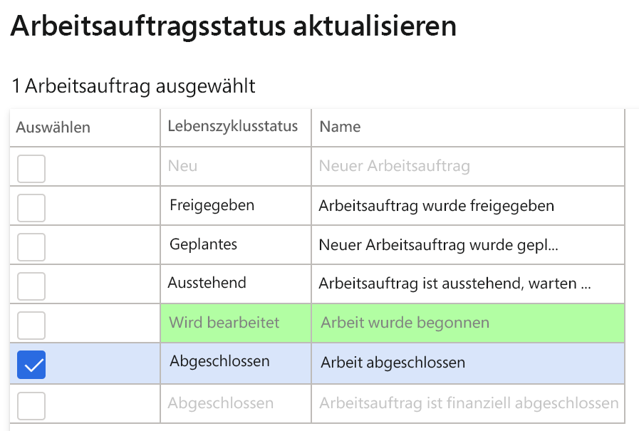

---
lab:
    title: 'Laboratório 7: Crie uma ordem de serviço de manutenção'
    module: 'Módulo 1: Conheça os Princípios básicos do Microsoft Dynamics 365 Supply Chain Management'
---

## Laboratório 7 - Crie uma ordem de serviço de manutenção

**Objetivos**

As ordens de manutenção feitas no sistema descrevem a manutenção ou os reparos que são necessários para um ativo e são usadas para atribuir os recursos apropriados para concluir a solicitação de manutenção. A Ordem de serviço é criada com base na ordem de manutenção, que é executada pelo recurso alocado.

**Configuração do laboratório**

Tempo estimado: 15 min.

**Instruções**

1. Na home page do Finance and Operations, na parte superior direita, verifique se você está trabalhando com a empresa USMF.

2. Se necessário, selecione a empresa e, no menu, selecione **USMF**.

3. No painel de navegação da esquerda, selecione **Módulos** **&gt; Gerenciamento de ativos &gt; Solicitações de manutenção &gt; Estágios do ciclo de vida.**

4. Selecione InProgress e clique no botão **Editar** no painel de ação.

5. Na guia **Geral**, mude o valor de **Criar ordem de serviço** para Sim.

6. No painel de navegação da esquerda, selecione **Módulos** **&gt; Gerenciamento de ativos &gt; Espaços de trabalho &gt; Gerenciamento de solicitações de manutenção.**

7. Clique em **Criar solicitação de manutenção.**

8. Insira os valores seguintes nos campos da caixa de diálogo e clique no botão **OK**.

	- Tipo de solicitação de manutenção: Corretiva

	- Descrição: Ruído no detector de metais

	- Local funcional: PP-02-02

	- Ativo: MD-201

	- Nível de serviço: 4

	- Sintoma de falha: Ruído excessivo

	- Área de falha: Elétrico 

9. Feche o formulário de **solicitação de manutenção** e volte para o espaço de trabalho do **Gerenciamento de solicitações de manutenção**

10. Atualize a página pressionando o ícone de **atualização** no canto superior direito da tela.

11. A nova solicitação de manutenção aparecerá na lista de solicitações de manutenção sem ordem de serviço.

12. Selecione a solicitação de manutenção recém-criada e clique no botão **Atualizar estado da solicitação de manutenção**. 

13. Na caixa de diálogo, marque a caixa de seleção ao lado de InProgress e clique em **OK**

 

14. Selecione a solicitação de manutenção recém-criada e clique no botão **Criar ordem de serviço**. 

15. Insira os valores seguintes nos campos da caixa de diálogo e clique no botão **OK**.

	- Tipo de trabalho de manutenção: Inspeção

16. Uma nova ordem de serviço será criada e a ordem de serviço será atualizada no registro de solicitação de manutenção selecionado.

17. Clique na ordem de serviço e vá para a tela **Detalhes da ordem de serviço**.

18. Nas Linhas da ordem de serviço, clique no botão **Expedir**.

19. Insira os valores seguintes nos campos da caixa de diálogo e clique no botão **OK**.

	- Trabalho: Ted Howard

20. No menu de Ação, vá para **Ordem de serviço &gt; Estado do ciclo de vida &gt; Atualizar estado da ordem de serviço.**

21. Na caixa de diálogo, marque a caixa de seleção ao lado de InProgress e clique em **OK**

22. Selecione a data e hora de **Início real** na caixa de diálogo e clique em **OK.**

23. No menu de ação da Ordem de serviço, vá novamente para **Ordem de serviço &gt; Estado do ciclo de vida &gt; Atualizar estado da ordem de serviço.**

24. Na caixa de diálogo, marque a caixa de seleção ao lado de Concluído e clique em **OK**

25. No campo **Final real**, selecione uma data e hora que seja maior que a data e hora de início e clique em OK

26. Você encontrará o estado do ciclo de vida atual no cabeçalho da ordem de serviço como concluído.
