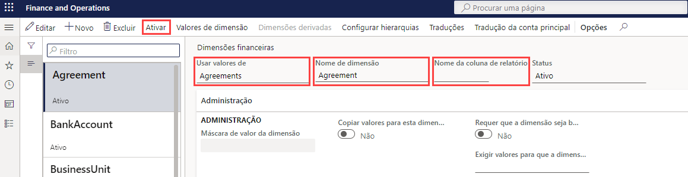

---
lab:
    title: 'Laboratório 1: Criar uma dimensão financeira'
    module: 'Módulo 2: Conheça os princípios básicos do Microsoft Dynamics 365 Finance'
---

## Laboratório 1 - Criar uma dimensão financeira

## Objetivos

Use a página Dimensões financeiras para criar dimensões financeiras que você pode usar como segmentos de contas em planos de contas. Há dois tipos de dimensões financeiras: as dimensões personalizadas e as dimensões apoiadas por entidades. As dimensões personalizadas são compartilhadas entre entidades legais e os valores são inseridos e mantidos pelos usuários. Para dimensões embasadas por entidades, os valores são definidos em algum outro lugar do sistema, como entidades de clientes ou lojas. Algumas dimensões embasadas por entidades são compartilhadas entre entidades legais, enquanto outras são específicas de empresas.

Você precisa criar uma dimensão financeira personalizada que será usada pela sua empresa.

## Configuração do laboratório

   - **Tempo estimado**: 5 minutos

## Instruções

1. Na home page do Finance and Operations, na parte superior direita, verifique se você está trabalhando com a empresa USMF.

1. Se necessário, selecione a empresa e, no menu, selecione **USMF**.

1. No painel de navegação à esquerda, selecione **Módulos** > **Contabilidade** > **Plano de contas** > **Dimensões** > **Dimensões financeiras**.

1. No menu superior, selecione **+ Novo**.

1. Na página Dimensões financeiras, selecione o menu **Usar valores de** e, em seguida, **< Dimensão personalizada >**.

1. Na caixa **Nome da dimensão**, digite **Receita_Afiliada**.

1. Na caixa **Nome da coluna de relatório**, digite **Afil**.

1. No menu superior, selecione **Ativar**.

    

1. Examine as informações na caixa de diálogo e selecione **Fechar**.

1. Veja a faixa de notificação de aviso.

    

    >[!OBSERVAÇÃO] O modo de manutenção pode ser ativado e desativado diretamente por meio do Lifecycle Services (LCS) nos seus ambientes de área restrita e produção. Mais informações sobre como gerenciar o Lifecycle Services podem ser encontradas em [https://docs.microsoft.com/pt-br/dynamics365/fin-ops-core/dev-itpro/deployment/maintenanceoperationsguide-newinfrastructure](https://docs.microsoft.com/pt-br/dynamics365/fin-ops-core/dev-itpro/deployment/maintenanceoperationsguide-newinfrastructure).
