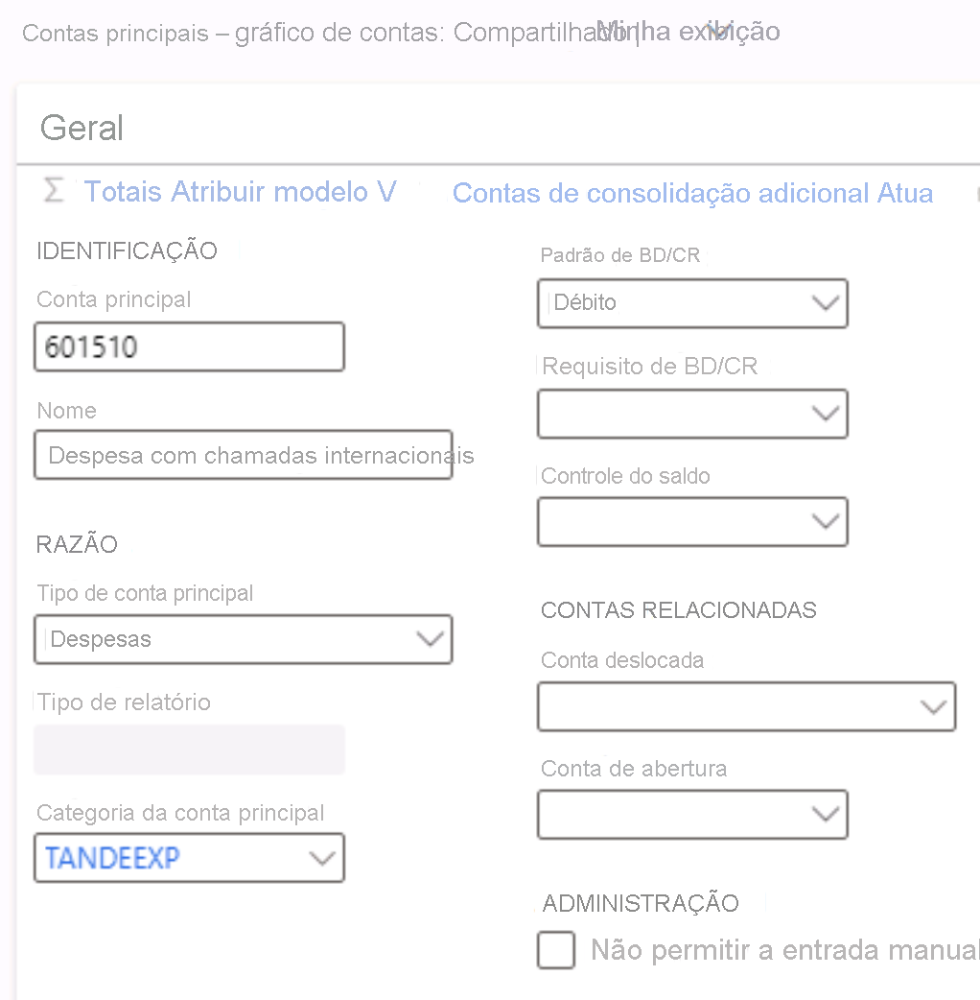

---
lab:
  title: 'Laboratório 1: Criar uma conta principal'
  module: 'Module 2: Learn the Fundamentals of Microsoft Dynamics 365 Finance'
---

# Módulo 2: Conheça os princípios básicos do Microsoft Dynamics 365 Finance

## Laboratório 1: Criar uma conta principal

## Configuração do Laboratório

   - **Tempo estimado**: 5 minutos

## Instruções

1.  Na página inicial **Finanças e Operações**, na parte superior direita, verifique se você está trabalhando com a empresa **USMF**. 

2.  Se necessário, selecione o seletor da empresa e escolha **USMF**. 

3.  No painel de navegação esquerdo, no módulo **Contabilidade**, selecione **Plano de contas** > **Contas** > **Contas principais**.

4.  Selecione **+ Novo** no painel de ações.

5.  Insira os seguintes valores na página **Conta principal**: 

    - Conta principal: `601510`

    - Nome: `International call expense`

    - Tipo de conta principal: `Expense`

    - Categoria da conta principal: `TANDEEXP`

    - Padrão de DB/CR: `Debit`

    

6.  Selecione **Salvar** e **feche** a página. 

