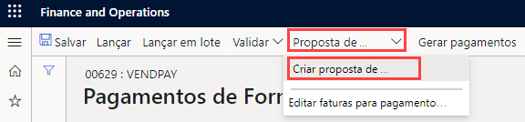

---
lab:
    title: 'Laboratório 2: Criar diário de pagamentos de fornecedor'
    module: 'Módulo 2: Conheça os princípios básicos do Microsoft Dynamics 365 Finance'
---

## Laboratório 2 - Criar diário de pagamentos de fornecedor

## Objetivos

Organizações que pagam fornecedores de modo recorrente agora podem automatizar o processo de gerar propostas de pagamento de fornecedor. As automações de proposta de pagamento de fornecedor definem os seguintes detalhes:

- Quando as propostas de pagamento são executadas
- Quais critérios são usados para selecionar as faturas que devem ser pagas
- Em qual diário de pagamentos de fornecedor os pagamentos resultantes são salvos

As automações de propostas de pagamento não lançam os pagamentos automaticamente. Portanto, você pode continuar usando qualquer processo de validação e fluxo de trabalho que existente no momento para aprovar os pagamentos criados.

Crie uma nova entrada de diário de pagamentos de fornecedor e proposta de pagamento.

## Configuração do laboratório

   - **Tempo estimado**: 10 minutos

## Instruções

1. Na home page do Finance and Operations, na parte superior direita, verifique se você está trabalhando com a empresa USMF.

1. Se necessário, selecione a empresa e, no menu, selecione **USMF**.

1. No painel de navegação à esquerda, selecione **Módulos** > **Contas a pagar** > **Pagamentos** > **Diário de pagamentos de fornecedor**.

1. No menu superior, selecione **+ Novo**.

1. Observe o novo número do lote do diário que foi criado.

1. Na caixa **Nome**, digite **Forn.** e depois selecione **VendPay** na lista filtrada.

1. No menu superior, selecione **Linhas**.

1. Na página Pagamentos de fornecedor, no menu superior, selecione **Proposta de pagamento** > **Criar proposta de pagamento**.  
    A proposta de pagamento é uma consulta usada para selecionar faturas para pagamento. É possível editar a lista de faturas a pagar antes de criar ou gerar os pagamentos de fornecedor.

    

1. No painel Proposta de pagamento de fornecedor, em **CRITÉRIOS DE SELEÇÃO DA FATURA**, selecione o menu **Selecionar faturas por**, examine as opções disponíveis e depois selecione **Data de vencimento**.

1. Em **De** e **Até**, exclua os valores existentes. Para este exercício, esses intervalos de datas ficarão em branco.

    >[!OBSERVAÇÃO] Uma data de pagamento mínimo pode ser usada como a data de pagamento. A data de pagamento mínimo será a data mais próxima usada durante a criação de pagamentos. Por exemplo, se uma fatura tiver uma data de vencimento posterior à data de pagamento mínimo, o vencimento se tornará a data de pagamento, em vez da data de pagamento mínimo, para pagar a fatura na data mais recente possível.

1. Expanda **Registros a serem incluídos** e depois examine as opções.  
    Com frequência, o filtro é usado para restringir as faturas selecionadas para pagamento por grupo de fornecedores ou método de pagamento. Por exemplo, você pode adicionar um filtro para pagar apenas faturas por cheque nessa rodada de pagamentos.

1. Expanda **Parâmetros avançados** e, em seguida, examine as opções disponíveis.  
    Os parâmetros adicionais podem ser usados para definir a moeda de pagamento ou para permitir pagamentos centralizados para essa rodada de pagamentos.

1. Selecione **OK**.  
    Depois que você selecionar OK, os resultados da consulta serão exibidos. Se você não quiser visualizar a lista de faturas selecionadas para pagamento, volte para a guia rápida Parâmetros e altere a configuração **Criar pagamentos sem visualização de fatura** como **Sim**.

1. Na janela Proposta de pagamento de fornecedor, selecione **Mostrar visão geral do pagamento** para ver os pagamentos que serão criados para o fornecedor na fatura selecionada.

    

1. No menu, selecione **Ocultar visão geral do pagamento** para ocultar os pagamentos.

1. Selecione o ícone de marca de seleção à esquerda do cabeçalho da coluna **Nome do fornecedor** para selecionar todas as faturas.

    

1. Desmarque a caixa de seleção das três primeiras faturas e, em seguida, no menu, selecione **Remover** para remover todas as outras faturas.

    

1. Na caixa de diálogo, selecione **Sim**.

1. Examine as três faturas restantes.

1. Para exportar a lista de faturas para o Excel, clique com o botão direito do mouse na grade e selecione uma opção de exportação.

1. No canto inferior direito, selecione **Criar pagamentos** para criar os pagamentos de fornecedor no diário de pagamentos.

1. Examine a lista de pagamentos de fornecedor.
