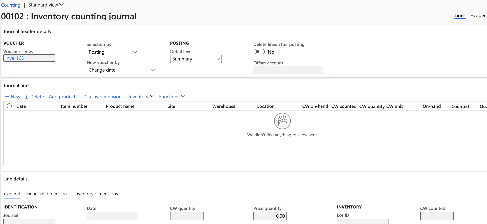

---
lab:
  title: 'Laboratório 3: Criar um diário de contagem'
  module: 'Module 3: Learn the Fundamentals of Microsoft Dynamics 365 Supply Chain Management'
---

# Módulo 3: Conheça os Princípios básicos do Microsoft Dynamics 365 Supply Chain Management

## Laboratório 3: Criar um diário de contagem

## Configuração do Laboratório

   - **Tempo estimado**: 10 minutos

## Instruções

1.  Na página inicial **Finanças e Operações**, na parte superior direita, verifique se você está trabalhando com a empresa **USMF**. Se necessário, selecione a empresa e, no menu suspenso, clique em **USMF**. 

2.  No painel de navegação esquerdo, no módulo **Gerenciamento de estoque**, selecione **Entradas do diário** > **Contagem de itens** > **Contagem**. 

3.  Pressione o botão **+ Novo** no painel de ação. O painel de diálogo **Criar diário de inventário** será exibido. Selecione o botão **OK**. 

4.  O formulário do **diário de contagem de inventário** será exibido com informações de cabeçalho e linha. 

    

5.  No painel de ações, selecione **Criar linhas –&gt; Estoque**. 

6.  No painel de diálogo **Criar diário de contagem de estoque**, defina os campos **Depósito**, **Status do estoque**, **Localização** e **Placa de licença** como **Sim**. 

    

7.  Expanda a seção **Registros a incluir** e selecione o botão **Filtrar**. Para o campo **Número do item**, insira `A0001` no campo **Critérios** e selecione **OK**. 

8.  Selecione **OK** na parte inferior do painel de diálogo **Criar diário de contagem de estoque**. 

    As quantidades em estoque do item **A0001** serão exibidas na seção **Linhas do diário** com informações detalhadas sobre Local, Depósito e Localização. 

9.  Na coluna **Contagem** da seção **Linha do diário**, combine os números contados para cada Local/Depósito e Localização. Observe o seguinte: 

    - Se a quantidade **Disponível** for igual à quantidade da **Contagem**, o campo **Quantidade** ficará em branco. 

    - Se o valor do campo **Contagem** for maior que o valor do campo **Disponível**, o campo **Quantidade** conterá um valor positivo. 

    - Se o valor do campo **Contagem** for menor que o valor do campo **Disponível**, o campo **Quantidade** conterá um valor negativo. 

10. Altere o ano do campo **Data** em cada linha para 2022. 

11. Pressione o botão **Validar** no painel de ação e selecione **OK** no painel de diálogo. 

12. Selecione o botão **Postar**. 

13. **Feche** a página e retorne à página inicial. 

